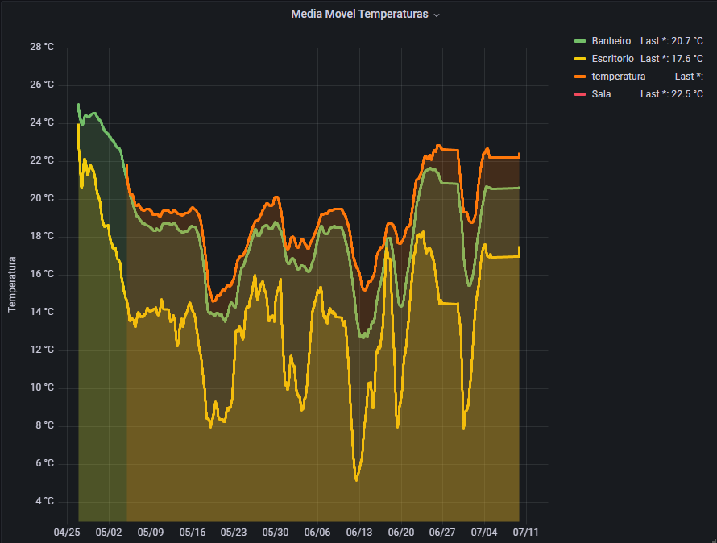

# Arduino Sensor de Temperatura com postgresql e grafana
Projeto simples para população de um banco de dados em postgressql para a materia de banco de dados 2.

ESP8266 juntamente de sensor DHT11 para medir dados de temperatura e umidade.
A inserção no banco de dados é feita utilizando python na maquina servidor.
Os ESP se comunicam com o servidor utilizando BROADCAST UDP.

## Graficos com resultados:

## Autores
Fabio Slika Stella
Everton Pagnoncelli